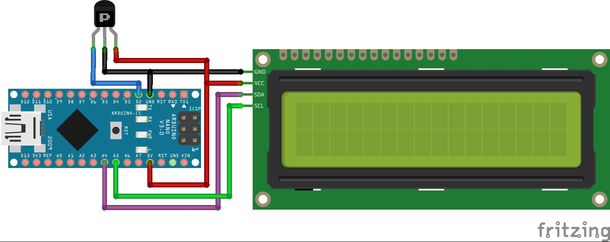

# Tachometer_arduino

RPM meter based on an arduino and a hall effect sensor. With the default parameter setting running on Arduino Nano, the code is expected to work accurately in the range between 30 and 1200 RPM.

**Component:**
* Arduino Nano
* Hall effect sensor (This project used A3144)
* Magnet (to be put on the rotating device as a marker)
* Power bank (power source for using the arduino independently of a computer)
* 16x2 LCD display (display info.)

This code detects a magnet and computes the elapsed time between two magnet detections. The frequency in Hz is computed accordingly and converted into RPM. However, the RPM is set to zero if the magnet is not detected for over a specified period of time.

**The device can work in 2 modes:**
* Connected to a computer and display the RPM reading on the serial monitor
* Used as a mobile device but this needs a powerbank and a LCD display

